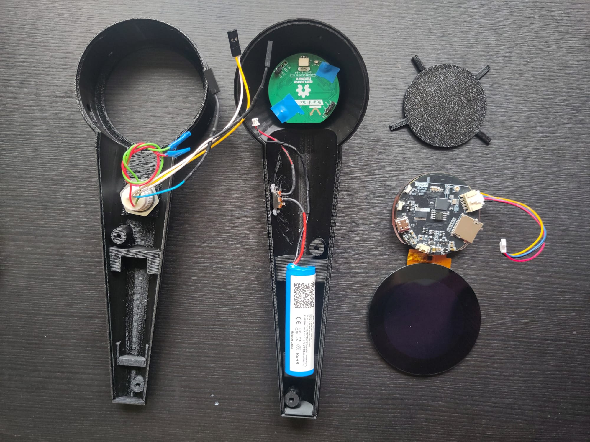

## Design Enclosure 
The enclosure was designed to house the following components:
- Lilygo T-RGB board
- PCB scanner module
- Button
- 3.7V Battery (JST mini connector)
- On/Off shifter
- 2x M3 screws (one 20mm, one 10mm)

The design includes a holding space for the battery and multiple fixtures for all other components. Since the project is still in the development phase, all fixtures were kept simple and reversible to ensure easy access to the components. Additionally, screw holders were added to provide the option of closing the device. These are intended for use with wooden screws and cannot be opened indefinitely, as the threads may break. However, the device closes firmly without screws, so for development purposes, they are not required.

## Printing Orientation:
The printing orientation was optimized for better surface texture. It was found to be best to orient the top part with the open side facing down, and the bottom part with the open side facing up. The open side is the side where the components are mounted. Printing at a slower speed with a layer height of 0.1 mm per slice produced the most uniform and pleasant-to-touch surface.

## Further Work:
The USB-C port access could be improved and the fixtures changed to more durable solutions, if the design is more definit. 

## References: 
The CAD was manly influenced by the design analysis from Markus Glavind and Brandt Gregersen Gustav found here: 

Markus Glavind & Brandt Gregersen Gustav. (2023). PlasticScanner—Development and product realisation of a NIR polymer scanner. Master Thesis, DTU, 122.

Markus Glavind, [handheld scanner](https://github.com/Plastic-Scanner/handheld-scanner.git) 
