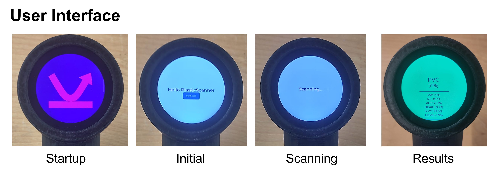

## Firmware
This is the firmware for the handheld PlasticScanner using a LilyGO board and is built as a PlatformIO project. The firmware can initiate a scan and send the received data to the machine learning model. The model then provides a prediction of which type of plastic was scanned. Since the current model was trained with different IR LEDs, the results are not accurate. The model would need to be retrained to generate correct predictions.

In the illustration, the 1720 nm LED is shown in red. It is currently unavailable and was replaced with a (green) 850 nm LED. The orange 1650 nm LED was initially available (delivery date pushed to 18.08.2026) but has now also been discontinued.

Additionally, the firmware is still implemented as an example within the complete LilyGO firmware. This is necessary because the ESP32-S3 crashes immediately after startup if the firmware is used outside of the example structure. To run the current firmware, the platformio.ini file needs to be configured as follows:
 
<code style="color:red;">src_dir = examples/PlasticScanner</code>

Implemented features:
- Deep-sleep after long button press
- Deep-sleep after timeout of 5min
- Waking from Deep-sleep with long button press
- Scan after short button press
- old machine learning Model
- Startup UI
- Inital UI
- Scanning UI
- Results UI

The firmware can be uploaded to the LilyGO by pressing the BOOT and RESET buttons simultaneously, then releasing RESET first, followed by BOOT, and immediately starting the firmware upload.

## Future Work
The next steps should be generating training data for the machine learning model, particularly for the 850 nm LED, and reviewing the available training data from the PlasticScanner project. Different versions of the model should be compared before retraining one of them with the specified IR LED wavelength range. Additionally, the AS7341 color sensor could be implemented in the firmware and incorporated into the training data.

## References
This firmware is based on:
- LilyGO T-RGB firmware
- https://github.com/Xinyuan-LilyGO/LilyGo-T-RGB.git

Machine Learning Repositories:
- https://github.com/Plastic-Scanner/Machine-Learning.git

Traning Data:
- https://github.com/Plastic-Scanner/Data.git 

Visualization, especially for Developement Board:
- https://github.com/Plastic-Scanner/PSplot.git 

