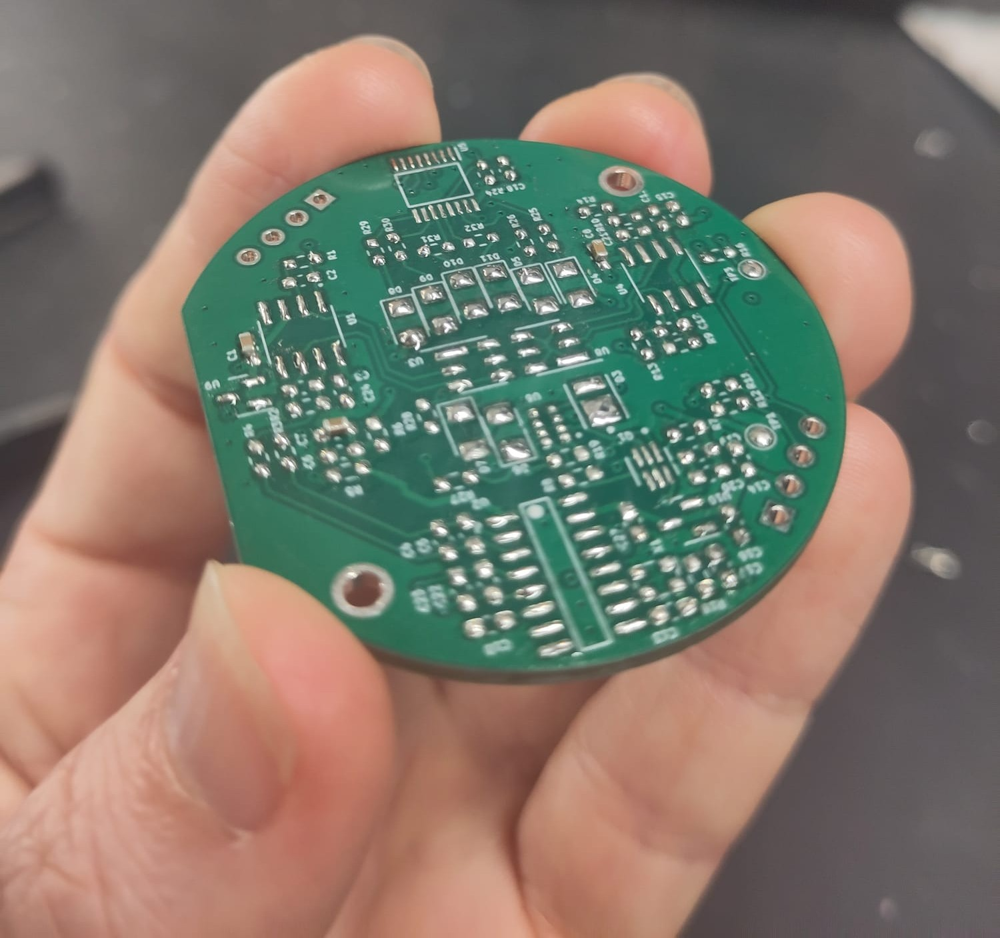
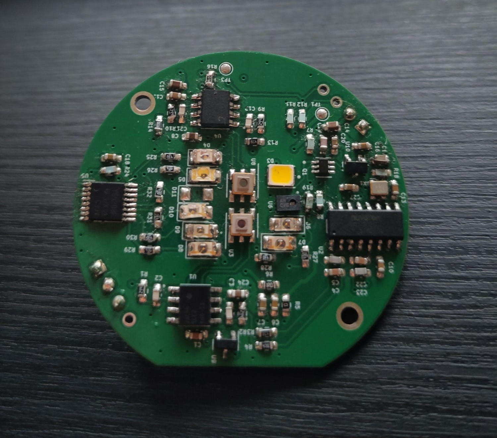

## Hardware

The hardware has the following components:

- Scanning PCB
- Lilygo T-RGB
- Button
- on/off switch
- 3.7V 2600mAh Battery, rechargable 

## Scanning PCB
The Scanning PCB was adapted from Lawrence Kincheloe's design, which is the latest version of the PlasticScanner handheld design. The IR LED wavelengths were changed to available LED's and a few Resistor values had to be changed accordingly. 

Lawrence R Kincheloe III, [handheld scanner](https://github.com/LokiMetaSmith/handheld-scanner.git)

The PCB was soldered by hand using low-temperature solder paste, a soldering iron, a hot-air gun, and a microscope. The 1650nm IR LED is still missing, since its delivery data has been pushed to the 18.08.2026. 

  
  

## Further Work
- IR LED sourcing problems -> change to push through LED's instead of SMD
- Separated LED PCB (first design exists)
- Find better solution for Button Signal (currently BOT Button repurposed as an external input)
- to reduce cost the design could be changerd to only one photodiode or the LED count could be reduced

