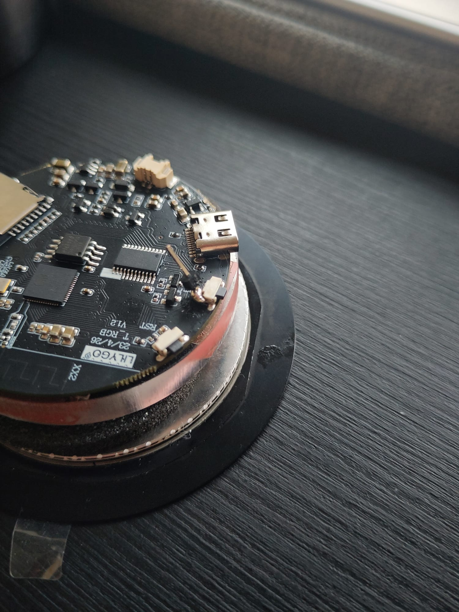

## Hardware

The hardware has the following components:

- Scanning PCB
- Lilygo T-RGB
- Button
- on/off switch

## Scanning PCB
The Scanning PCB was adapted from Lawrence Kincheloe's design, which is the latest version of the PlasticScanner handheld design. The IR LED wavelengths were changed to available LED's and a few Resistor values had to be changed accordingly. 

Lawrence R Kincheloe III, [handheld scanner](https://github.com/LokiMetaSmith/handheld-scanner.git)

## Further Improvements
- IR LED sourcing problems -> change to push through LED's instead of SMD
- Separated LED PCB (first design exists)
- Find better solution for Button Signal (currently BOT Button repurposed as an external input)

