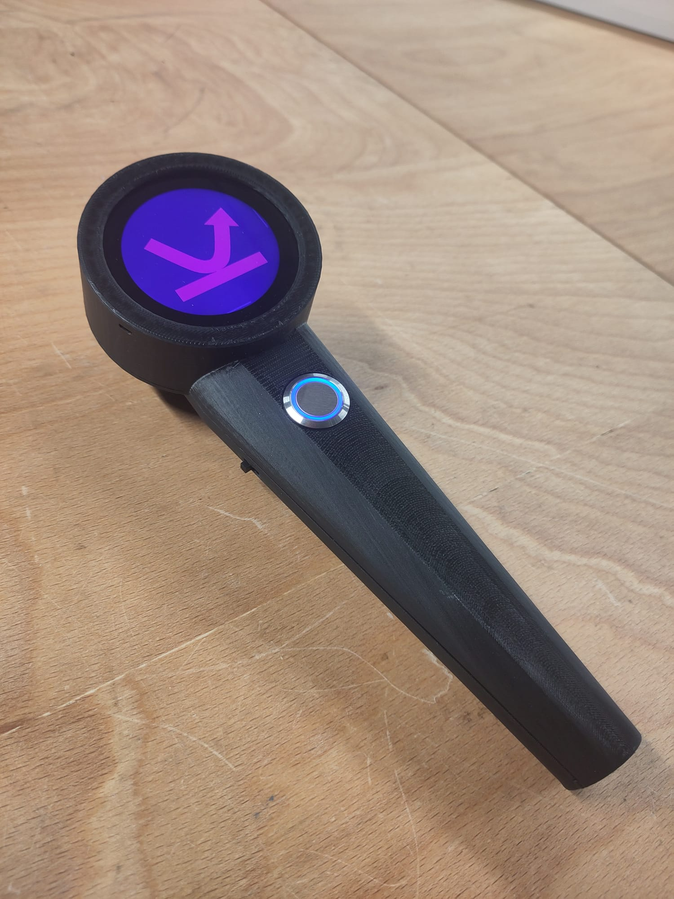
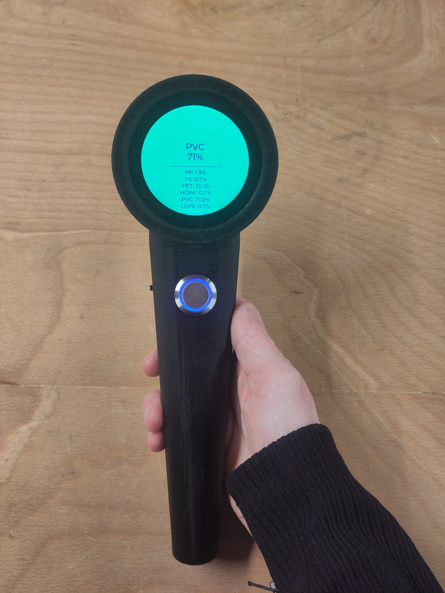
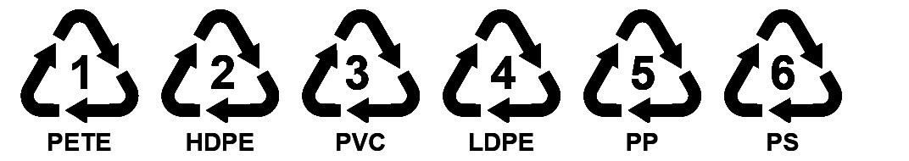
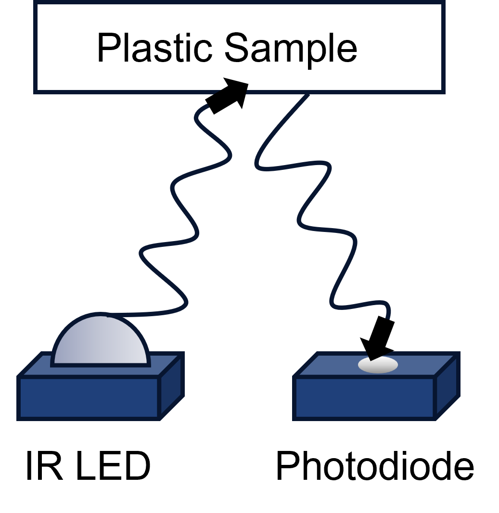
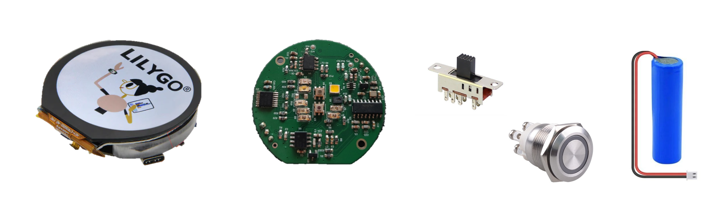

## Plastic Scanner
The goal of this project is to build a minimum viable product of the open-source [PlasticScanner](https://github.com/Plastic-Scanner) project and assess its suitability for the Global Health Engineering Lab. The design builds on the existing expertise of the project and incorporates the newest hardware version, Development Board 2.3. The overall objective of the project is to evaluate the scanner’s adaptability to the use case in Malawi and identify opportunities for improvement. This scanner is fully functional and can be reproduced for testing and development purposes. However, it is not recommended for any commercial application. Further development is still required.

  
  

## Introduction
Plastic is a widely used material, inexpensive to manufacture, and therefore a common choice for single-use products. However, due to its extensive use, global plastic pollution and its subsequent degradation in landfills into micro- and nanoplastics are threatening ecosystems (Walker & Fequet, 2023). Estimates indicate that plastic consumption will increase from 464 Mt/y in 2020 to over 700 Mt/y by 2050 (Dokl et al., 2024). Plastic recycling is established, but it first requires thorough separation of plastic components. Industrial plastic scanners employ various spectroscopic methods, with Near-Infrared (NIR) spectroscopy being the primary technology (Werner et al., 2023). Light is emitted, and the reflected relative light intensity from the material is measured to identify its composition.

Especially for small-scale recycling facilities and projects with limited financial resources, commercial plastic scanners are extremly expensive. Sorting is therefore done manually, which is often labor-intensive and inaccurate. An example is WASTE Adviser (WASTE Adviser Website, 2025), an NGO in Malawi that is establishing plastic beneficiation pathways for PET and HDPE. For the quality of the upcycled product, it is essential that the plastic is sorted with high accuracy. Otherwise, the recycled product suffers from embrittlement.

The PlasticScanner is an open source project which developed a low-cost plastic identification method. Utilizing inexpensive infrared LEDs and a machine learning model to identify the following six types of plastic:

## How it works
The PlasticScanner allows the identification of six different plastic types using an approach called discrete near-infrared (NIR) spectroscopy. The IR LEDs on the Scanner module emit light one by one for a short period of time. Each time, the reflectance of the emitted light is measured by a photodiode.

This results in a spectral analysis of the measured reflectance. Plastic identification is performed by comparing each measurement with the distinct reflectance spectra of the six plastic types (see illustration, for visualization only, not to scale). Since the device only provides eight readings at specific wavelengths and the actual reflectance spectra of plastics can be very similar, a machine learning model is applied. The model helps identify plastics more reliably without requiring a full spectral sweep. Additional information, such as color, can further improve the model, as dark plastics are particularly challenging to identify with this method.

## Handheld Device

Components:
- 3D printed enclosure
- Scanning PCB (I2C for data transfer)
- Lilygo T-RGB UI interface, ESP32-S3 Microcontroller, USB-C port, Battery recharging, (I2C for data transfer)
- 3.7V 2600mAh Battery
- Button
- Power on/off shifter

## Future Work
- Create Training Data for machine learning Model with correct  IR LED range
- Retrain machine learning Model
- Add Color Sensor in Firmware
- Testing
- Supplychain addaptations (IR LED sourcing problems)

There is still a lot to improve! The most important point is that the current machine learning model still uses the old dataset, which relied on different IR LED ranges. To finalize this device, the model would need to be retrained with data for the wavelengths actually used (see Firmware). Due to this, testing has not yet been performed. Establishing the accuracy of the device and testing it for the intended use case is of high importance. The color sensor is included on the PCB but has not yet been implemented in the firmware. For future designs, the supplier of the IR LEDs should be changed, as especially high-wavelength LEDs are difficult to source and often have long delivery times. Switching to through-hole LEDs would increase the number of available suppliers and simplify sourcing.

## References
PlasticScanner Website: https://plasticscanner.com/ 

PlasticScanner Github: [Plastic-Scanner Project](https://github.com/Plastic-Scanner)

PCB: Lawrence R Kincheloe III, [handheld scanner](https://github.com/LokiMetaSmith/handheld-scanner.git)

CAD: Markus Glavind, [handheld scanner](https://github.com/Plastic-Scanner/handheld-scanner.git) 

Walker, T. R., & Fequet, L. (2023). Current trends of unsustainable plastic production and micro(nano)plastic pollution. TrAC Trends in Analytical Chemistry, 160, 116984. https://doi.org/10.1016/j.trac.2023.116984

Dokl, M., Copot, A., Krajnc, D., Fan, Y. V., Vujanović, A., Aviso, K. B., Tan, R. R., Kravanja, Z., & Čuček, L. (2024). Global projections of plastic use, end-of-life fate and potential changes in consumption, reduction, recycling and replacement with bioplastics to 2050. Sustainable Production and Consumption, 51, 498–518. https://doi.org/10.1016/j.spc.2024.09.025 

Werner, T., Taha, I., & Aschenbrenner, D. (2023). An overview of polymer identification techniques in recycling plants with focus on current and future challenges. Procedia CIRP, 120, 1381–1386. https://doi.org/10.1016/j.procir.2023.09.180

WASTE Adviser Website. (2025, Oktober 7). https://www.wasteadvisersmw.org/eu-building-better
